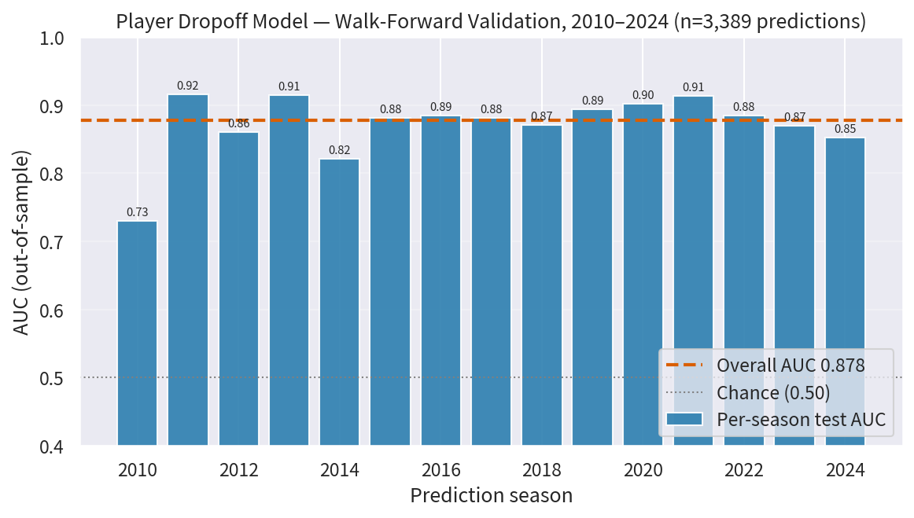
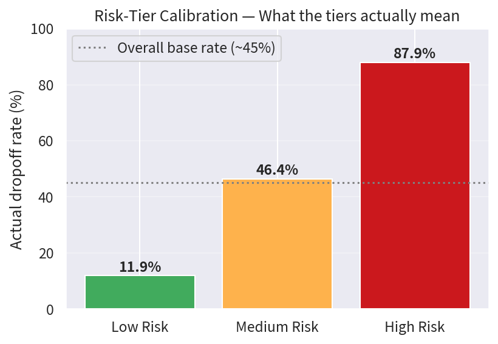

# ML4FF — Machine Learning for Fantasy Football

**Predicting which NFL players are about to fall off a cliff — validated over 15 seasons of walk-forward backtesting.**

## Results

The player dropoff pipeline was validated with proper time-series (walk-forward) validation: every season from 2010–2024 was predicted using *only data available before that season*. No random train/test splits.

- **3,389 out-of-sample predictions** across 15 seasons
- **Overall AUC: 0.878** (per-season range 0.73–0.92)
- **Risk tiers are calibrated:** players flagged High Risk actually declined **87.9%** of the time, vs. 46.4% (Medium) and 11.9% (Low), against a ~45% base rate





### Notable calls

High-confidence predictions (>70% dropoff probability) that proved correct — 670 in total, including:

| Season | Player | Pos | Team | Prior fantasy points | Dropoff prob. |
|---|---|---|---|---|---|
| 2021 | Derrick Henry | RB | TEN | 175.3 | 0.86 |
| 2017 | Ezekiel Elliott | RB | DAL | 177.2 | 0.84 |
| 2024 | Tua Tagovailoa | QB | MIA | 181.6 | 0.82 |
| 2021 | Alvin Kamara | RB | NO | 187.7 | 0.78 |
| 2021 | Dalvin Cook | RB | MIN | 172.3 | 0.78 |
| 2019 | Saquon Barkley | RB | NYG | 192.1 | 0.72 |
| 2021 | Russell Wilson | QB | SEA | 242.8 | 0.71 |
| 2018 | Carson Wentz | QB | PHI | 192.7 | 0.71 |

Full list: [`results/high_confidence_correct_predictions.csv`](results/high_confidence_correct_predictions.csv). Validation detail: [`results/SUMMARY_REPORT.txt`](results/SUMMARY_REPORT.txt).

### What actually predicts decline

Feature importance from the validated model:

1. **Games played** (injury) — the dominant signal
2. **Workload relative to career peak**
3. Position and team changes — moderate impact

## Pipelines

| Pipeline | What it predicts | Status |
|---|---|---|
| **Dropoff** (`src/player_dropoff_pipeline.py`) | 20%+ fantasy-point decline | ✅ Backtested (results above) |
| **Breakout** (`src/player_breakout_pipeline.py`) | 30%+ fantasy-point increase | ⚠️ Built, not yet backtested |
| **Rookie boom/bust** (`src/rookie_projection_pipeline.py`) | Rookie tiering from college production + combine + transition rates + preseason usage | ⚠️ Built, not yet backtested |

## Quick start

```bash
pip install -r requirements.txt
python src/player_dropoff_pipeline.py    # writes predictions + backtest CSVs to cwd
```

Notebooks demonstrating each pipeline are in [`notebooks/`](notebooks/).

## Data

All player data from [nflverse](https://github.com/nflverse/nflverse-data) (2005–2024 seasons).

## Repo layout

```
src/        pipeline code
notebooks/  usage examples
results/    validated outputs: backtest summaries, calibration, predictions
```

## License

MIT
